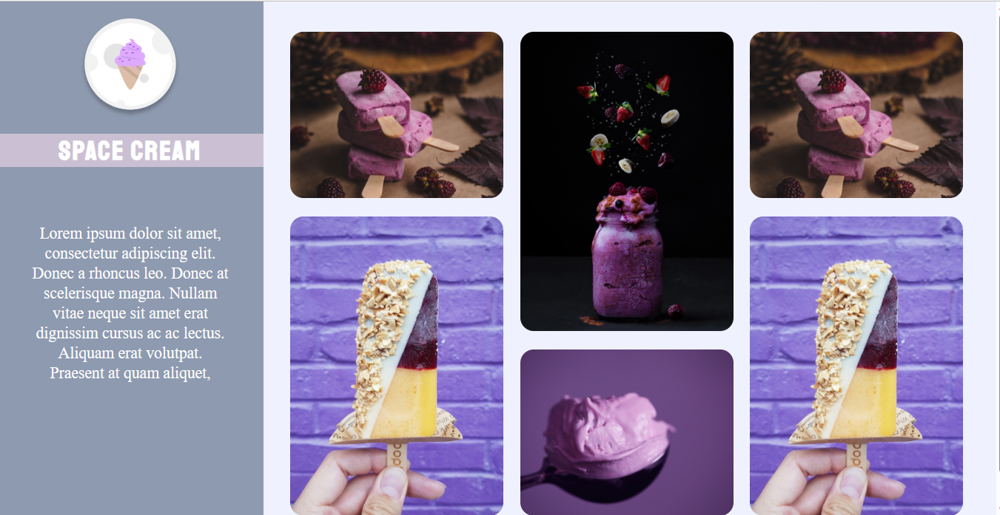

<h1 align="center">Space Cream</h1>

This project refers to a challenge proposed for the students of class 09 of Explorer to test their knowledge.

  <a href="#-technologies">Technologies</a>&nbsp;&nbsp;&nbsp;|&nbsp;&nbsp;&nbsp;
  <a href="#-projeto">Project</a>&nbsp;&nbsp;&nbsp;|&nbsp;&nbsp;&nbsp;
  <a href="#-layout">Layout</a>&nbsp;&nbsp;&nbsp;|&nbsp;&nbsp;&nbsp;
  <a href="#memo-licença">License</a>

 

  

## 🚀 Technologies

This project was developed with the following technologies:

- HTML e CSS
- Git e Github

## 💻 Project

The Space Cream project was developed to study the use of HTML and responsive CSS for mobile. In this project, we built an application for an ice cream shop. Among the most common themes are:

- Structuring an HTML project;
- Use of more common HTML tags;
- Initial CSS concepts;
- Positioning and alignment of elements on the screen with grid;
- Applying custom fonts;
- Image positioning;
- Gaps;
- Animations;
- Keyframes.

## 🔖 Layout

You can view the layout of the project through [THIS LINK](https://www.figma.com/file/Nws1KWB7DyXBw8L6wXb9mp/Stage-03---Formul%C3%A1rio-intermedi%C3%A1rio/duplicate). It is necessary to have an account in the [Figma](https://figma.com) to access it.

## 🔗 Links

 

## 📝 License

 
This project is under license MIT.

---
Made with ♥ by Rocketseat 👋 [Join our community!](https://discord.gg/rocketseat)

# Desafio 4 -Stage 3-Explorer-Rocketseat